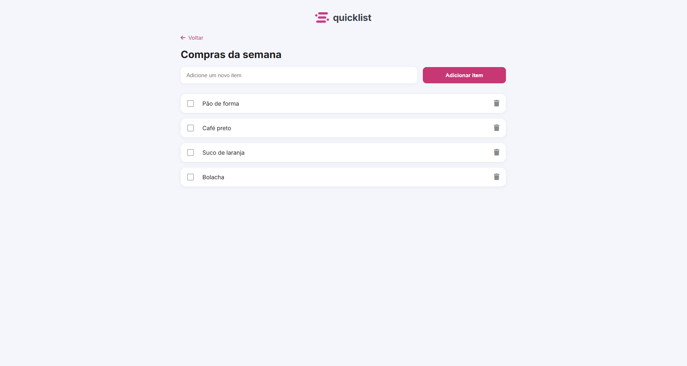

  <h1> Lista de Compras</h1>
  
Aplicação web desenvolvida com foco em experiência do usuário, organização de código e boas práticas de Frontend.

---

## 📌 Sobre o Projeto

A **Lista de Compras** é uma aplicação web interativa que permite ao usuário adicionar, visualizar e marcar itens como concluídos de forma dinâmica.

O projeto simula uma necessidade real do dia a dia: organizar compras de maneira prática. Foi desenvolvido com foco em:

- Usabilidade simples
- Resposta visual imediata
- Código organizado e escalável
- Estrutura preparada para evoluções futuras

A aplicação funciona inteiramente no navegador, utilizando JavaScript para manipulação do DOM e controle de estados da interface.

---

## 📸 Preview da Aplicação

  

---

## 🎯 Objetivo do Projeto

Desenvolver uma aplicação funcional simulando um pequeno produto real, aplicando fundamentos sólidos de desenvolvimento Frontend.

Durante o desenvolvimento, foquei em:

- Estrutura HTML semântica e bem organizada  
- Separação clara entre estrutura, estilo e comportamento  
- Código JavaScript limpo, legível e escalável  
- Experiência do usuário simples e intuitiva  
- Base preparada para futuras evoluções  

---

## 🚀 Funcionalidades

- Adição dinâmica de itens  
- Marcação de itens como concluídos  
- Atualização visual imediata via manipulação do DOM  
- Interface organizada e responsiva  

---

## 🛠️ Tecnologias Utilizadas

| Tecnologia | Aplicação no projeto |
|------------|----------------------|
|  **HTML5** | Estrutura semântica e organização do conteúdo |
|  **CSS3** | Layout, responsividade e experiência visual |
|  **JavaScript (ES6+)** | Manipulação do DOM, controle de eventos e lógica da aplicação |

---

## 📈 Aprendizados e Evolução Técnica

Durante esse projeto, consolidei conhecimentos importantes para o mercado:

- Manipulação eficiente do DOM  
- Controle de eventos (`click`, `submit`)  
- Estruturação de pequenas aplicações sem frameworks  
- Organização de código pensando em manutenção futura  
- Aplicação prática de raciocínio lógico  
- Separação de responsabilidades (HTML, CSS, JS)  

Esse projeto reforçou minha base em desenvolvimento web e minha capacidade de transformar requisitos simples em soluções funcionais.

---

⭐ Se este projeto chamou sua atenção, fique à vontade para explorar o código!

